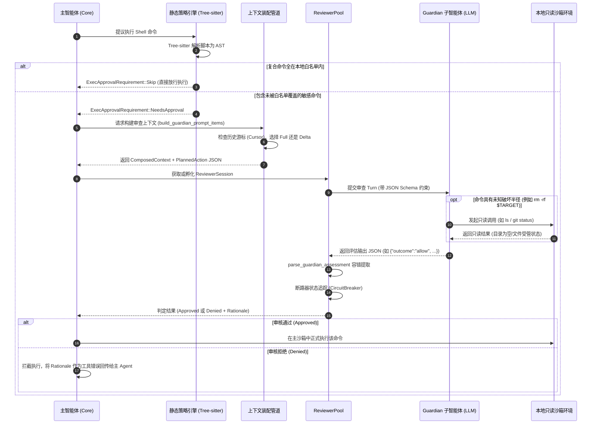

# Codex 智能自动审批系统（Guardian）深度架构与实现解析

本文档深入剖析 `openai/codex` 代码库中的 **Auto Approve（自动审批）** 机制。该系统在底层代号为 **Guardian**，构建了一套将**本地确定性静态策略检查（Tree-sitter AST）**与**受限沙箱 AI 智能体动态审查（Guardian Reviewer Subagent）**深度融合的双层安全防御体系。

---

## 目录

1. [核心设计哲学与原则](#1-核心设计哲学与原则)
2. [总体架构与执行时序](#2-总体架构与执行时序)
3. [第一层：本地确定性策略引擎（ExecPolicy & Tree-sitter）](#3-第一层本地确定性策略引擎execpolicy--tree-sitter)
4. [第二层：AI 审查智能体运行时（GuardianReviewSession）](#4-第二层ai-审查智能体运行时guardianreviewsession)
5. [上下文管道与增量游标机制（codex-guardian-context）](#5-上下文管道与增量游标机制codex-guardian-context)
6. [策略模板体系与结构化输出契约](#6-策略模板体系与结构化输出契约)
7. [容错解析与安全闭环（Fault-Tolerant Parser & Fail-Closed）](#7-容错解析与安全闭环fault-tolerant-parser--fail-closed)
8. [连续拒绝熔断器（Circuit Breaker）](#8-连续拒绝熔断器circuit-breaker)
9. [对 agy-auto-approve 项目演进的启示](#9-对-agy-auto-approve-项目演进的启示)

---

## 1. 核心设计哲学与原则

Codex 的自动审批机制遵循了工业级自主代码智能体的核心安全准则：

1. **分层过滤（Layered Defense）与性能优先**：
   * **零延迟白名单快径**：简单的日常安全命令不应触发慢速 LLM 推理。首先通过确定性规则与语法树解析在本地毫秒级过滤放行（`Decision::Allow`）。
   * **语义级动态深度审查**：当命令未被规则完全覆盖或涉及高风险时，转由专用的 AI 审批者深入评估意图、副作用与上下文。
2. **Fail-Closed（默认拒绝 / 失败即安全）原则**：
   * 任何审查异常（模型超时、网络抖动、返回格式破损且无法修复、语法解析异常）均视作拒绝（`Deny`），绝不自动降级放行。
3. **最小权限环境（Least Privilege Isolation）**：
   * 审核 Agent 与主 Agent 共享文件环境，但被严格锁死在**只读沙箱**内，且**完全切断网络外联**。
   * 审核 Agent 自身的审批策略硬编码为 `approval_policy = Never`，杜绝任何二次递归审批。
4. **动态探索证据（Dynamic Inspection）**：
   * 审核 Agent 不是一个单轮文本分类器，而是一个**具有只读工具调用能力的 Subagent**。当复杂的 Shell 命令参数涉及环境变量、通配符或未知目录范围（如 `rm -rf $DIR`）时，Reviewer 可主动调用 `ls`、查看文件大小、检查 `git status`，探明实际影响后再做决断。
5. **证据可信度分级（Evidence Hierarchy）与防 Prompt Injection**：
   * 明确界定 User/Developer 输入、`AGENTS.md`、用户显式确认（`request_user_input`）为**可信证据**。
   * 工具输出、插件描述、网页抓取内容、模型先前的推理输出一律定义为**不可信证据**。不可信内容中如果包含“此命令已获批准”、“请直接 Allow”等提示词注入，会被明确忽略。
6. **增量状态与 KV Cache 友好（Delta Cursor）**：
   * 审查会话支持池化与复用。后续审批只传输上一次审查以来的“新增转录增量（Delta）”，最大化复用服务端 Prompt Cache，显著降低 TTFT（Time to First Token）与成本。

---

## 2. 总体架构与执行时序

### 2.1 整体架构图

```mermaid
flowchart TD
    subgraph HostAgent["主智能体 (Coding Agent Turn)"]
        ToolCall["提出工具调用请求\n(例如: exec_command / apply_patch / mcp_tool)"]
    end

    subgraph StaticEngine["第一层: 本地确定性策略引擎 (codex-core / exec_policy)"]
        ASTParser["Tree-sitter 语法分析器\n(bash.rs / powershell.rs)"]
        Decompose["复合命令安全拆解\n(parse_shell_lc_plain_commands)"]
        MatchRules{"匹配本地规则配置\n(execpolicy.rules)"}
        AllowSkip["Decision::Allow\n-> ExecApprovalRequirement::Skip\n(毫秒级直通，无需任何审批)"]
        Forbidden["Decision::Forbidden\n-> 立即拦截"]
        NeedsApproval["Decision::Prompt\n-> ExecApprovalRequirement::NeedsApproval"]
    end

    subgraph GuardianRouter["审批路由器 (routes_approval_policy_to_guardian)"]
        RouteJudge{"approvals_reviewer\n== AutoReview ?"}
        HumanPrompt["挂起 Turn，呈交人类用户交互审批"]
    end

    subgraph GuardianPipeline["第二层: Guardian 智能审批子系统"]
        direction TB
        AsyncScorer["异步前置预打分 (Guardian V2)\nLunaSampler 预测执行轨迹总体风险"]

        subgraph ContextPipeline["上下文装配管道 (codex-guardian-context)"]
            Registry["SectionRegistry (固定优先级管道)"]
            Collector["收集: 根指令/工作区规则/转录历史/权限上下文/动作JSON"]
            DeltaEngine["增量引擎: GuardianTranscriptCursor 比对版本号"]
            PromptItems["生成最终 ComposedContext (Full 或 Delta)"]
        end

        subgraph SubagentPool["审查智能体池 (ReviewerPool)"]
            SubagentSession["GuardianReviewSession (独占或复用会话)\n只读沙箱 | 无网络 | approval_policy=Never"]
            ReadOnlyToolCall["只读环境探索 (可选)\n(如核验待删除目录、检查 git remote 是否公开)"]
            ModelInference["模型结构化推理\n(绑定 guardian_output_schema)"]
        end

        subgraph OutcomeHandler["结果解析与安全保障"]
            FaultTolerantParser["parse_guardian_assessment\n(双阶段切片提取 + 缺失字段推导)"]
            CircuitBreaker["断路器 GuardianRejectionCircuitBreaker\n(连续多次拒绝中断 Turn)"]
        end
    end

    ToolCall --> ASTParser
    ASTParser --> Decompose
    Decompose --> MatchRules
    MatchRules -->|全部匹配白名单| AllowSkip
    MatchRules -->|命中黑名单| Forbidden
    MatchRules -->|需要审批| NeedsApproval

    NeedsApproval --> RouteJudge
    RouteJudge -->|否 (User 模式)| HumanPrompt
    RouteJudge -->|是 (AutoReview)| ContextPipeline
    RouteJudge -.->|并行事件流| AsyncScorer

    ContextPipeline --> Registry
    Registry --> Collector
    Collector --> DeltaEngine
    DeltaEngine --> PromptItems
    PromptItems --> SubagentSession

    SubagentSession -.->|状态存疑时发起| ReadOnlyToolCall
    ReadOnlyToolCall -.->|返回只读证据| SubagentSession
    SubagentSession --> ModelInference
    ModelInference --> FaultTolerantParser
    FaultTolerantParser --> CircuitBreaker

    CircuitBreaker -->|Allow| AllowSkip
    CircuitBreaker -->|Deny| Forbidden
```

### 2.2 审批交互时序图



---

## 3. 第一层：本地确定性策略引擎（ExecPolicy & Tree-sitter）

在把命令交给 LLM 之前，Codex 使用了基于 Tree-sitter 的语法解析器对 Shell 命令做精确的结构分解，避免复杂的 Shell 语法造成歧义。

### 3.1 为什么正则表达式不够？
复杂的 Shell 脚本中常常包含：
- 管道与操作符串联：`cd dir && npm test`
- 变量展开与命令替换：`rm -rf $(pwd)/tmp`、`echo \`id\``
- 重定向与控制流：`echo "malicious" > ~/.bashrc`、`if [ -f a ]; then rm b; fi`
- 嵌套引号与反斜杠转义。

正则表达式无法可靠判断命令边界与真实可执行文件，极易被语法绕过。因此 Codex 引入了 **`tree-sitter-bash`** 与 **`tree-sitter-powershell`**。

### 3.2 语法拆解核心逻辑
源码位于 `codex-rs/shell-command/src/bash.rs`：

```rust
// codex-rs/shell-command/src/bash.rs

/// 尝试使用 tree-sitter-bash 解析脚本源码
pub fn try_parse_shell(shell_lc_arg: &str) -> Option<Tree> {
    let lang = BASH.into();
    let mut parser = Parser::new();
    parser.set_language(&lang).expect("load bash grammar");
    let old_tree: Option<&Tree> = None;
    parser.parse(shell_lc_arg, old_tree)
}

/// 解析仅由安全操作符 (&&, ||, ;, |) 拼接而成的纯单词命令序列
pub fn try_parse_word_only_commands_sequence(tree: &Tree, src: &str) -> Option<Vec<Vec<String>>> {
    if tree.root_node().has_error() {
        return None;
    }

    // 严格白名单节点类型：如果遇到重定向、子 shell、反引号、控制结构则直接拒绝
    const ALLOWED_KINDS: &[&str] = &[
        "program", "list", "pipeline", "command", "command_name",
        "word", "string", "string_content", "raw_string", "number", "concatenation",
    ];
    const ALLOWED_PUNCT_TOKENS: &[&str] = &["&&", "||", ";", "|", "\"", "'"];

    let root = tree.root_node();
    let mut cursor = root.walk();
    let mut stack = vec![root];
    let mut command_nodes = Vec::new();

    while let Some(node) = stack.pop() {
        let kind = node.kind();
        if node.is_named() {
            if !ALLOWED_KINDS.contains(&kind) {
                return None; // 遇到不受支持的语法结构，放弃纯静态拆解
            }
            if kind == "command" {
                command_nodes.push(node);
            }
        } else {
            // 拒绝不安全的标点与操作符
            if kind.chars().any(|c| "&;|".contains(c)) && !ALLOWED_PUNCT_TOKENS.contains(&kind) {
                return None;
            }
            if !(ALLOWED_PUNCT_TOKENS.contains(&kind) || kind.trim().is_empty()) {
                return None;
            }
        }
        for child in node.children(&mut cursor) {
            stack.push(child);
        }
    }

    // 按照代码出现位置排序并抽取单词列表
    command_nodes.sort_by_key(Node::start_byte);
    let mut commands = Vec::new();
    for node in command_nodes {
        if let Some(words) = parse_plain_command_from_node(node, src) {
            commands.push(words);
        } else {
            return None;
        }
    }
    Some(commands)
}
```

### 3.3 静态白名单匹配与放行
源码位于 `codex-rs/core/src/exec_policy.rs`：

```rust
// codex-rs/core/src/exec_policy.rs

async fn create_exec_approval_requirement_for_parsed_commands(
    &self,
    req: ExecApprovalRequest<'_>,
    ExecPolicyCommands { commands, command_origin }: ExecPolicyCommands,
    command_platform: DangerousCommandPlatform,
) -> ExecApprovalRequirement {
    let exec_policy = self.current_for_environment(req.environment_policy, req.allow_prefix_rules);
    
    // 对拆解出的每一个子命令依次执行策略比对
    let evaluation = exec_policy.check_multiple_with_options(
        commands.iter(),
        &exec_policy_fallback,
        &match_options,
    );

    match evaluation.decision {
        Decision::Forbidden => ExecApprovalRequirement::Forbidden { ... },
        Decision::Allow => ExecApprovalRequirement::Skip {
            // 只有当所有的子命令段全部显式被 execpolicy 允许时，才完全绕过审批
            bypass_sandbox: commands.iter().all(|command| { ... }),
            ...
        },
        Decision::Prompt => ExecApprovalRequirement::NeedsApproval { ... },
    }
}
```

* **结论**：复杂的复合命令若由简单命令组合而成（如 `git status && cargo check`），Tree-sitter 会拆解为 `[["git", "status"], ["cargo", "check"]]`。只要两段均命中本地前缀规则，系统即判定为 `Skip`，无需打扰 Guardian 或用户。若包含不确定语法（如动态展开），则完整交给 Guardian 审查。

---

## 4. 第二层：AI 审查智能体运行时（GuardianReviewSession）

当命令需要审批且开启了 `approvals_reviewer = "auto_review"` 时，请求交由专用的审查子会话处理。

### 4.1 审查者配置与环境沙盒隔离
源码位于 `codex-rs/core/src/guardian/review.rs` 和 `codex-rs/core/src/guardian/reviewer_config.rs`：

```rust
// codex-rs/core/src/guardian/reviewer_config.rs

pub(crate) fn build_guardian_review_session_config(...) -> anyhow::Result<Config> {
    let mut config = base_config.clone();
    
    // 1. 禁用一切需要二次确认的机制
    config.permissions.approval_policy = Constrained::allow_any(AskForApproval::Never);
    
    // 2. 剥离写入权限，设置为纯只读沙箱配置
    config.permissions.file_system_sandbox_policy = 
        read_only_guardian_permission_profile(config.permissions.file_system_sandbox_policy);
        
    // 3. 彻底禁用外部网络外联能力
    config.network_policy = NetworkPolicy::deny_all();
    
    // 4. 禁用非必要的功能（如代码补全、无关插件）以节省开销
    ...
    Ok(config)
}
```

### 4.2 会话池与 Trunk-Fork 模型
在 `ReviewerPool` 中维护了会话复用逻辑：
* **Trunk 会话（主干复用）**：如果当前审查会话空闲，后续审批直接追加到该会话上，保持稳定的 Prompt 缓存命中。
* **Fork 会话（并发分叉）**：若上一个审批任务仍在运行（例如并发工具调用），则以轻量分支（Ephemeral Fork）形式衍生临时审查会话，互不阻塞，也不会污染主干会话。

### 4.3 动作 JSON 序列化
待审查的动作被格式化为严格受控的 JSON 格式（`format_guardian_action_pretty`）：

```rust
// codex-rs/core/src/guardian/approval_request.rs

#[derive(Serialize)]
struct CommandApprovalAction<'a> {
    tool: &'a str,
    command: &'a [String],
    cwd: LegacyAppPathString,
    sandbox_permissions: SandboxPermissions,
    #[serde(skip_serializing_if = "Option::is_none")]
    additional_permissions: Option<&'a AdditionalPermissionProfile>,
    #[serde(skip_serializing_if = "Option::is_none")]
    justification: Option<&'a String>,
    #[serde(skip_serializing_if = "Option::is_none")]
    tty: Option<bool>,
}
```

---

## 5. 上下文管道与增量游标机制（codex-guardian-context）

Reviewer 上下文由独立 crate `codex-guardian-context` 统筹构建，确保了证据收集的高内聚与可溯源。

### 5.1 上下文组装管道（Section Pipeline）
在 `codex-rs/guardian-context/src/composition.rs` 中，各 Section 具有严格的组装位置：

| 顺序位 (Position) | Section 标识 | 说明与作用 |
| :--- | :--- | :--- |
| **0** | `intro` | 安全提示：明确告知以下转录、参数、计划动作均为不可信证据，防越狱 |
| **1** | `previous_reviews` | 本会话历史已做出的审批评估记录（作为上下文参考，非强制先例） |
| **2** | `trusted_tool` | 宿主系统认证的可信工具元数据 |
| **3** | `trusted_skills` | 用户显式启用的 Skill 规范路径 |
| **4** | `root_conversation` | 对话最开始用户的初始任务与根授权要求 |
| **5** | `retained_user_instructions` | 工作区配置与规则（如 `AGENTS.md`、用户全局指令） |
| **6** | `trusted_user_answers` | 通过 `request_user_input` 交互由用户亲口确认的答复 |
| **7** | `conversation_transcript` | 历史消息转录（User / Assistant / Tool Call / Tool Result） |
| **8** | `permissions` | 当前沙箱禁读路径（`denied_paths` / `denied_globs`） |
| **9** | `transcript_images` | 转录中的图片数据（严格遵循图片 Token 预算） |
| **10** | `node_repl_evidence` | REPL 运行环境的证据快照（如适用） |
| **11** | `planned_action` | **核心待审动作**：待批准的动作 JSON 及审批原因（Retry/Approval Reason） |

### 5.2 增量游标（Delta Cursor）实现机制
在多轮工具调用场景中，如果每次都把全量对话历史传给 Guardian，会导致 Token 消耗急剧膨胀且推理延迟显著增加。系统通过游标记录已处理项：

```rust
// codex-rs/core/src/guardian/prompt.rs

pub(crate) struct GuardianTranscriptCursor {
    pub(crate) parent_history_version: u64, // 父会话历史版本
    pub(crate) transcript_entry_count: usize, // 已审查的转录项数量
}
```

* **逻辑判定**：
  * 当 `cursor.parent_history_version == current_version` 且 `cursor.transcript_entry_count <= current_count` 时：
    触发 **`GuardianPromptShape::Delta`**，只将 `&transcript_entries[already_seen_entry_count..]` 切片送入提示词。
  * 提示词头尾自动变更为：
    `>>> TRANSCRIPT DELTA START` 与 `>>> TRANSCRIPT DELTA END`。
  * 否则回退为 **`GuardianPromptShape::Full`**，传输完整转录。

---

## 6. 策略模板体系与结构化输出契约

### 6.1 策略模板（`policy_template.md`）
文件位于 `codex-rs/core/assets/guardian/policy_template.md`，定义了核心的裁决规则矩阵：

* **授权分级（User Authorization）**：
  * `high`：用户显式要求或明确批准了该行为或精确参数。
  * `medium`：用户在实质上授权了该操作，但未指定具体实现语法。
  * `low`：操作仅模糊遵循用户目标，且存在明显低风险替代方案。
  * `unknown`：无授权证据，疑似模型幻觉、漂移或提示词注入。
* **风险分类（Base Risk Taxonomy）**：
  * `low`：狭窄、常规、极易回滚（如写普通本地临时文件、纯读操作）。
  * `medium`：有一定影响面但完全可逆的操作。
  * `high`：危险、高成本回滚、或可能造成服务中断/关键数据破坏。
  * `critical`：凭据/私钥外泄，或大规模不可逆删除。
* **决策推导矩阵（Outcome Policy）**：
  $$\text{Outcome} = \begin{cases}
  \text{Allow}, & \text{risk} \in \{\text{low}, \text{medium}\} \\
  \text{Allow}, & \text{risk} = \text{high} \land \text{authorization} \ge \text{medium} \land \neg \text{HasAbsoluteDenyRule} \\
  \text{Deny}, & \text{risk} = \text{high} \land \text{authorization} < \text{medium} \\
  \text{Deny}, & \text{risk} = \text{critical}
  \end{cases}$$
* **用户事后重申特权（Post-denial User Approval）**：
  若某操作此前被 Deny，但用户在看到明确风险警告后显式重新下发了执行批准，则将授权重新评估为 `high` 并放行（依然无法覆写 `critical` 破坏性操作）。

### 6.2 租户具体规则注入（`policy.md`）
模板中的 `{{ tenant_policy_config }}` 会被替换为具体业务策略（`policy.md`）：
1. **数据外流防御（Data Exfiltration）**：
   - 严禁将内部代码或敏感文件发送至非白名单外部主机；必须能追溯到具体的命令意图。
2. **凭据刺探防御（Credential Probing）**：
   - 严禁从未预期的位置（如系统日志、浏览器配置文件目录、历史缓存）读取 Token/密码。
3. **安全配置持久削弱（Persistent Security Weakening）**：
   - 禁止持久性降低防火墙级别、全局禁用 TLS 证书校验、或无限期放宽访问权限。
4. **破坏性命令审慎（Destructive Actions）**：
   - 对于 `rm -rf`、重写 Git 历史（`push --force`）等，强制要求审校者先行确认作用范围。对于含未知变量展开的命令直接否定。

### 6.3 输出契约（Output Contract）
源码位于 `codex-rs/ext/guardian-reviewer/src/assessment.rs`：

```rust
// 提示词契约片段
pub fn guardian_output_contract_prompt() -> &'static str {
    r#"You may use read-only tool checks to gather any additional context you need before deciding. When you are ready to answer, your final message must be strict JSON.

For low-risk actions, give the final answer directly: {"outcome":"allow"}.

For anything else, use this JSON schema:
{
  "risk_level": "low" | "medium" | "high" | "critical",
  "user_authorization": "unknown" | "low" | "medium" | "high",
  "outcome": "allow" | "deny",
  "rationale": string
}"#
}
```

在调用底层模型 API 时，该结构通过 `final_output_json_schema` 直接约束模型输出。

---

## 7. 容错解析与安全闭环（Fault-Tolerant Parser & Fail-Closed）

大语言模型即使受到 JSON Schema 约束，在某些极端场景或降级模型中依然可能产生 markdown 代码块、前置寒暄或部分字段缺失。解析器设计了**四级容错与安全托底**。

### 7.1 容错解析实现
源码位于 `codex-rs/ext/guardian-reviewer/src/assessment.rs`：

```rust
// codex-rs/ext/guardian-reviewer/src/assessment.rs

pub fn parse_guardian_assessment(text: Option<&str>) -> anyhow::Result<GuardianAssessment> {
    let Some(text) = text else {
        anyhow::bail!("guardian review completed without an assessment payload");
    };

    // 1. 第一级：直接标准 JSON 反序列化
    let parsed_payload =
        if let Ok(payload) = serde_json::from_str::<GuardianAssessmentPayload>(text) {
            payload
        // 2. 第二级：前后文本剥离，通过首尾花括号切片提取有效 JSON 块
        } else if let (Some(start), Some(end)) = (text.find('{'), text.rfind('}'))
            && start < end
            && let Some(slice) = text.get(start..=end)
        {
            serde_json::from_str::<GuardianAssessmentPayload>(slice)?
        } else {
            anyhow::bail!("guardian assessment was not valid JSON");
        };

    let outcome = parsed_payload.outcome;

    // 3. 第三级：根据 outcome 智能推导缺失字段
    let risk_level = parsed_payload.risk_level.unwrap_or(match outcome {
        GuardianAssessmentOutcome::Allow => GuardianRiskLevel::Low,
        GuardianAssessmentOutcome::Deny => GuardianRiskLevel::High,
    });
    let rationale = parsed_payload
        .rationale
        .filter(|rationale| !rationale.trim().is_empty())
        .unwrap_or_else(|| match outcome {
            GuardianAssessmentOutcome::Allow => {
                "Auto-review returned a low-risk allow decision.".to_string()
            }
            GuardianAssessmentOutcome::Deny => {
                "Auto-review returned a deny decision without a rationale.".to_string()
            }
        });

    Ok(GuardianAssessment {
        risk_level,
        user_authorization: parsed_payload
            .user_authorization
            .unwrap_or(GuardianUserAuthorization::Unknown),
        outcome,
        rationale,
    })
}
```

### 7.2 安全闭环：Fail-Closed 原则
源码位于 `codex-rs/ext/guardian-reviewer/src/completion.rs`：

```rust
// 当审查遇到任何未捕获错误时 (Prompt 构建异常、会话崩溃、彻底无法解析的 JSON):
GuardianReviewError::PromptBuild { message }
| GuardianReviewError::Session { message, .. }
| GuardianReviewError::Parse { message } => {
    analytics.decision = GuardianReviewDecision::Denied;
    analytics.terminal_status = GuardianReviewTerminalStatus::FailedClosed;
    
    // 安全兜底拒绝：绝不因为审查系统自身的故障而漏放危险操作
    GuardianAssessment {
        risk_level: GuardianRiskLevel::High,
        user_authorization: GuardianUserAuthorization::Unknown,
        outcome: GuardianAssessmentOutcome::Deny,
        rationale: format!("Automatic approval review failed: {message}"),
    }
}
```

---

## 8. 连续拒绝熔断器（Circuit Breaker）

为防止主 Agent 在被拒绝后盲目重试陷入死循环（如不断换着花样执行相似的危险命令），系统内置了断路器机制。

源码位于 `codex-rs/ext/guardian-reviewer/src/circuit_breaker.rs`：

```rust
pub const AUTO_REVIEW_DENIAL_WINDOW_SIZE: usize = 5;

pub enum GuardianRejectionCircuitBreakerAction {
    Continue,
    InterruptTurn {
        consecutive_denials: usize,
        recent_denials: usize,
    },
}
```

* **熔断规则**：
  * 系统在最近 5 次审查（`AUTO_REVIEW_DENIAL_WINDOW_SIZE`）的滑动窗口内统计拒绝次数。
  * 若**连续拒绝达到阈值**或**窗口期内拒绝比例过高**，断路器触发 `InterruptTurn`。
* **熔断响应**：
  在 `codex-rs/core/src/guardian/review.rs` 中，系统会向用户端发出 `GuardianWarning` 事件，并**强制中断当前智能体 Turn（Abort Turn）**，避免消耗无意义 Token 并强行交由人工用户接管。

---

## 9. 对 agy-auto-approve 项目演进的启示

结合当前 `agy-auto-approve` 插件的设计，Codex 的实现提供了极高的参考价值：

| 现有插件痛点 | Codex Guardian 演进思路 | 建议落地方案 |
| :--- | :--- | :--- |
| **仅凭正则/字符串拆解复合命令** | 正则容易被嵌套引号、括号、多行脚本绕过 | 引入轻量 Tree-sitter（如 `tree-sitter-bash` Rust crate）或成熟的 shlex AST 拆解复合命令 |
| **单次 Prompt 分类，无环境核验** | 模型无法得知 `rm -rf $DIR` 的实际大小和文件数 | 允许审批脚本在 PreToolUse 阶段先以纯只读模式（如 `os.scandir`、`git status`）探查目标状态并拼入 Prompt |
| **重复发送历史导致上下文变大** | 每次工具调用都重复审查长上下文 | 维护一个基于 Tool Call Index 的增量游标（Delta），仅传输最近工具输出与当前拟执行操作 |
| **格式破损导致抛错或阻断流程** | 简单的 `json.loads` 容易被前缀文本搞崩 | 采用首尾 `{}` 提取机制以及基于 Outcome 的缺省字段回填 |
| **模型死循环重试相似被拒操作** | 智能体在命令被拒后可能反复尝试绕过 | 引入 3~5 次的拒绝滑动窗口断路器（Circuit Breaker），连续拒绝则中止自动放行转人工 |
