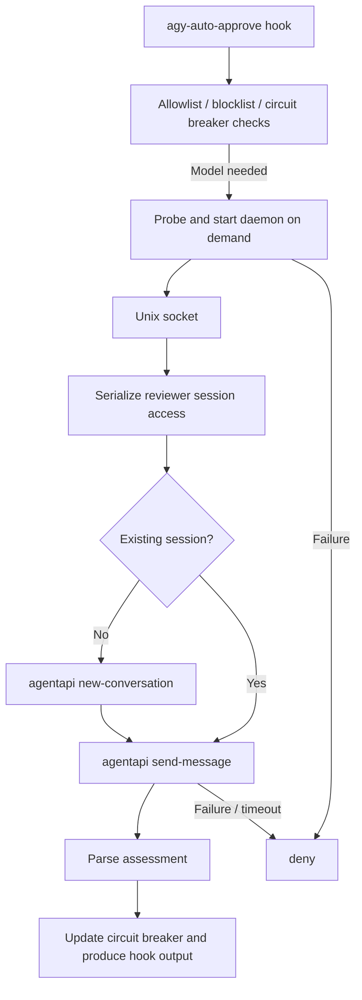

# Sidecars and the daemon

CLI and Antigravity Desktop use the same Rust executable, hook protocol, and approval pipeline. They differ in how the daemon starts. The runtime requires the host's `agentapi` command and an active login.

When invoking `agentapi`, the reviewer preserves the daemon's inherited PATH and appends
`$HOME/.gemini/antigravity-cli/bin` unless it is already present. Commands injected by
the sidecar host take priority, while launches outside a sidecar can also find the CLI
shim. Paths are constructed using Rust's `split_paths` / `join_paths` and the user's
HOME, supporting Linux and macOS without relying on Homebrew or a login shell. Only
the reviewer subprocess's PATH is changed. A failure after the program starts does
not switch execution to another copy of `agentapi`. The daemon retains its startup
environment.

## Startup and installation

```bash
agy-auto-approve install                  # Install both modes using the current binary
agy-auto-approve install --cli-only       # Register CLI only
agy-auto-approve install --desktop-only   # Register Desktop only
```

In CLI mode, `agy-auto-approve hook` probes the Unix socket when AI review is needed. If the daemon is unavailable, the hook starts the same executable with `daemon run` and probes for readiness within a three-second startup deadline. Read-only allowlist decisions, blocklist decisions, and an already-tripped circuit breaker do not require starting the daemon.

Desktop starts `agy-auto-approve daemon run` through the sidecar manifest deployed by the registration command. The manifest's `command` is the absolute path to the installed binary, with arguments `["daemon", "run"]`. The enabled entry is written to `sidecars.agy-auto-approve/approver` in `~/.gemini/config/config.json`.

```bash
agy-auto-approve daemon start
agy-auto-approve daemon status
agy-auto-approve daemon stop
agy-auto-approve daemon run --idle-timeout 0
```

The daemon exits after 1,800 idle seconds by default; `--idle-timeout 0` disables idle shutdown. Active reviews prevent idle shutdown, and status and stop requests can be handled during model calls. `agy-auto-approve update` refreshes enabled plugin configurations and stops the old daemon; Desktop users should then restart the host. Replacing the binary on disk does not update an already-running process.

## Request flow



## Socket and state

The default socket is `~/.gemini/antigravity-cli/approver.sock`, overridden by `AGY_APPROVER_SOCKET`. Both modes share this legacy path; using it does not require a CLI installation. The protocol uses newline-delimited JSON objects, not standard JSON-RPC 2.0.

| Action | Response |
| --- | --- |
| `ping` | `status: pong`, with process status |
| `status` | `status: running`, with PID, version, uptime, and review counts |
| `stop` | `status: stopping`, followed by shutdown and socket cleanup |
| `evaluate` | `status: ok` and an `assessment` |

Review requests contain `toolCall`, `workspacePaths`, and a `request_id` for log correlation. The client request timeout is 25 seconds. The daemon's review deadline is 24 seconds, including time waiting for the session lock and retrying a failed cached session. Each `agentapi` subprocess has a 20-second timeout.

Socket permissions are `0600`. The daemon holds an exclusive lock for its lifetime to prevent concurrent starters from replacing the same socket. A stale socket without a listener can be removed; regular files and symbolic links are not deleted as stale sockets.

The default state directory is `~/.gemini/antigravity-cli/state`. It contains `reviewer_session.json` for the session ID and `cb_<conversation>.json` for each caller conversation's circuit breaker state. `AGY_APPROVER_STATE_DIR` overrides this directory. If only `AGY_AUTO_APPROVE_LOG_DIR` is set, state is stored in the log directory's `state/` subdirectory.

## Session reuse and failure handling

A new reviewer session receives the prompt, and its session ID is persisted. Subsequent reviews submit only the proposed action through `send-message`. The daemon can load an existing session after a restart. If a cached session call fails, the cache is cleared, a new conversation is created, and the request is retried once. An initial failure without a cached session is denied immediately.

Session reuse reduces repeated context setup, but actual cache hit rates and response times depend on the host and model service. Reviewer configuration is global; project configuration files are not read. Changing the prompt or model does not update an existing reviewer session. Run `agy-auto-approve daemon restart` to clear the local session cache and create a new conversation on the next approval. Ordinary stops and starts preserve the session.

Failure to start the daemon, an unavailable `agentapi`, timeouts, or unparseable model responses result in `deny`. There is no alternate review path that directly invokes `agy`. Invalid hook input returns `ask`. A tripped circuit breaker returns `force_ask`.

## Logs

Both modes write to the plugin's own `~/.gemini/agy-auto-approve/` directory by default. `approvals.jsonl` stores correlated inputs, model requests and responses, and final decisions; `auto-approve.log` stores text summaries. Set `AGY_AUTO_APPROVE_LOG_DIR` to override the log location.

```bash
agy-auto-approve logs
agy-auto-approve logs -f
agy-auto-approve logs show APPROVAL_ID
```

`logs` reads local files directly without starting the daemon. See the [README](../README.md).
