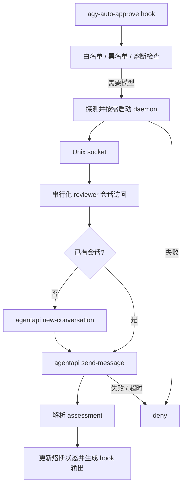

# Sidecar 与 daemon

CLI 和 Antigravity Desktop 使用相同的 Rust 可执行文件、hook 协议和审批管线，区别在于 daemon 的启动方式。运行环境需要宿主提供的 `agentapi` 命令及其登录状态。

## 启动与安装

```bash
./scripts/install.sh                  # 下载最新 Release、安装并注册两种模式
./scripts/install.sh --cli-only       # 仅注册 CLI
./scripts/install.sh --desktop-only   # 仅注册 Desktop
```

CLI 的 `agy-auto-approve hook` 在需要 AI 审批时探测 Unix socket；如果不可用，启动同一可执行文件的 `daemon run` 子进程，并在 3 秒启动期限内探测就绪状态。只读白名单、黑名单和已触发的熔断器无需启动 daemon。

Desktop 通过注册器部署的 sidecar manifest 启动 `agy-auto-approve daemon run`。manifest 的 `command` 是安装后二进制文件的绝对路径，参数为 `["daemon", "run"]`；启用项写入 `~/.gemini/config/config.json` 的 `sidecars.agy-auto-approve/approver`。

```bash
agy-auto-approve daemon start
agy-auto-approve daemon status
agy-auto-approve daemon stop
agy-auto-approve daemon run --idle-timeout 0
```

默认空闲 1800 秒退出，`--idle-timeout 0` 禁用空闲退出。审批进行中不会因空闲退出；状态和停止请求可在模型调用期间处理。升级后 CLI 用户重启 daemon，Desktop 用户重新注册并重启宿主。已运行进程不会因为磁盘上的二进制替换而自动升级。

## 请求流程



## Socket 与状态

默认 socket 为 `~/.gemini/antigravity-cli/approver.sock`，可用 `AGY_APPROVER_SOCKET` 覆盖。该历史路径仍由两种模式共用，不要求安装 CLI。协议是换行分隔的 JSON 对象，不是标准 JSON-RPC 2.0。

| action | 响应 |
| --- | --- |
| `ping` | `status: pong`，附进程状态 |
| `status` | `status: running`，附 PID、版本、运行时长、审批计数 |
| `stop` | `status: stopping`，随后关闭并清理 socket |
| `evaluate` | `status: ok` 和 `assessment` |

审批请求包含 `toolCall`、`workspacePaths` 和日志关联用的 `request_id`。客户端总请求超时为 25 秒；daemon 的审批期限为 24 秒，包含等待会话锁及失效会话重试的时间；单个 agentapi 子进程超时为 20 秒。

socket 权限为 `0600`。daemon 在存活期间持有独占锁，防止多个并发启动者覆盖同一 socket。无监听者的旧 socket 可以清理，普通文件和符号链接不会作为旧 socket 删除。

默认状态目录为 `~/.gemini/antigravity-cli/state`，其中 `reviewer_session.json` 保存会话 ID，`cb_<conversation>.json` 保存各调用方对话的熔断状态。`AGY_APPROVER_STATE_DIR` 可覆盖；只设置 `AGY_AUTO_APPROVE_LOG_DIR` 时，状态目录改为该日志目录的 `state/`。

## 会话复用与故障处理

新建 reviewer 会话时注入提示词并持久化会话 ID，后续只通过 `send-message` 提交待审操作。daemon 重启可以加载已有会话。缓存会话调用失败时清除缓存、重新创建并重试一次；没有缓存的首次失败直接拒绝。

复用会话可减少重复上下文建立，但实际缓存命中率和响应时间取决于宿主与模型服务。配置文件相对 daemon 启动目录解析，修改提示词不会改变已经创建的 reviewer 会话。

无法启动 daemon、agentapi 不可用、超时或无法解析模型响应时返回 `deny`。没有直接调用 `agy` 的备用审批路径。非法 hook 输入返回 `ask`。熔断器触发时返回 `force_ask`。

## 日志

两种模式默认写入插件自己的 `~/.gemini/agy-auto-approve/` 目录：`approvals.jsonl` 保存关联的输入、模型请求/响应及最终决定，`auto-approve.log` 保存文本摘要。环境变量 `AGY_AUTO_APPROVE_LOG_DIR` 可覆盖日志位置。

```bash
agy-auto-approve logs
agy-auto-approve logs -f
agy-auto-approve logs show APPROVAL_ID
```

`logs` 直接读取本地文件，不会启动 daemon。详见 [README](../README.md)。
